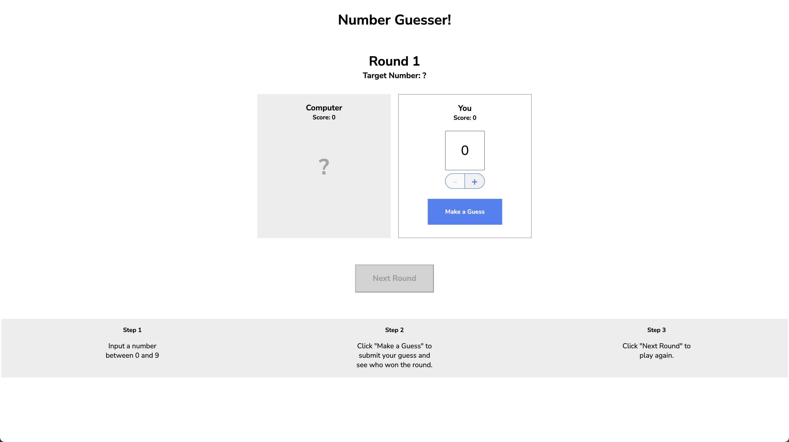

# Number Guesser

## Table of Contents
- [Introduction](#introduction)
- [Features](#features)
- [Installation](#installation)
- [Usage](#usage)
- [License](#license)
- [What I Did](#what-i-did)

## Introduction
The Number Guesser project is a simple game where the player tries to guess a randomly generated number within a specified range.  
The game provides feedback on whether the guess is too high, too low, or correct.

## Features
- Random number generation
- User input validation
- Feedback on guesses
- Configurable range for the random number

## Installation
To install, just download or clone the repository. No additional installation is required.

## Usage
To start the game, open the `index.html` file in a web browser. Instructions for the game will be displayed on the page.

## License
This project is licensed under the MIT License. See the [LICENSE](LICENSE) file for more information.

## What I Did
This was a challenge project where I was to create the logic of the game in the script.js file. The rest of the code was provided to me by Codecademy. 
In the script.js I fully commented the code to explain what each line is doing. This was a great project to practice more JavaScript basics.